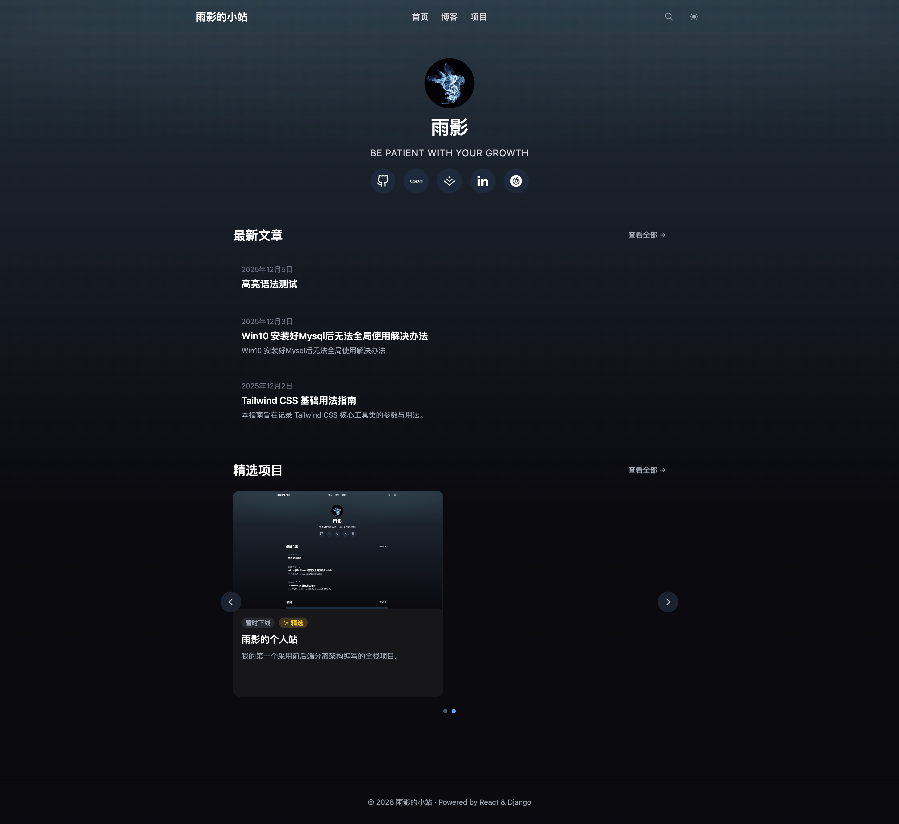
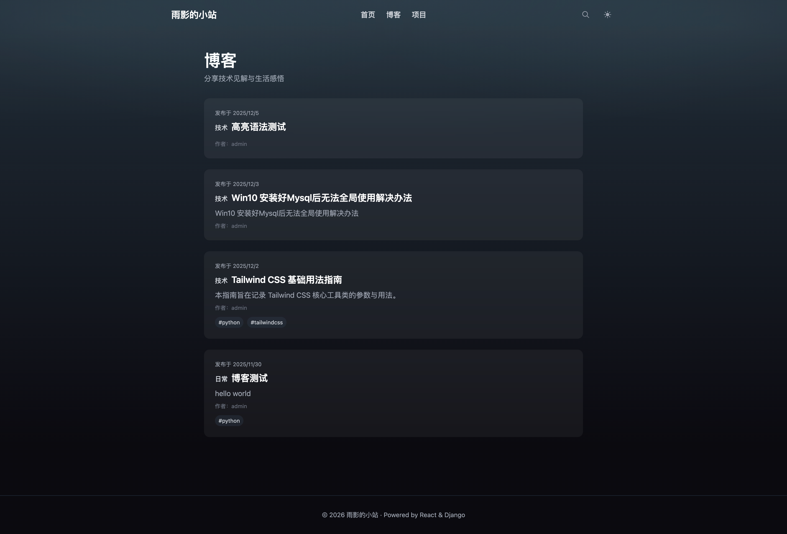
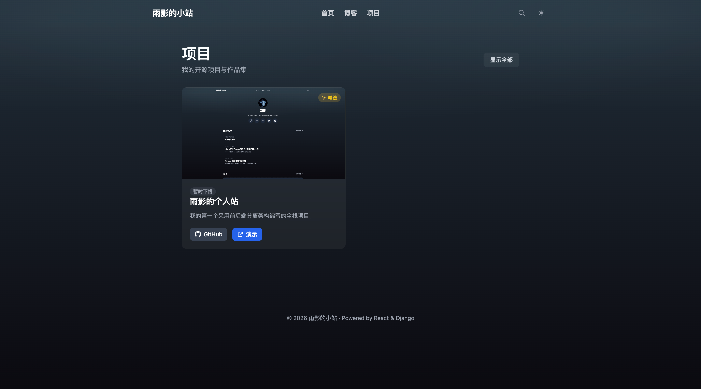

# 📝 个人博客（中文文档）

一个由 **Django REST Framework**（后端）与 **React + TypeScript + Tailwind CSS**（前端）构建响应式个人站。整体设计遵循简约风格。支持 Markdown、分类/标签管理、项目展示、全文搜索。

> ✨ 在线演示：[https://www.wangshixin.me](https://www.wangshixin.me)
> 📦 技术栈：Python 3.12 · Django 5.2 · DRF · PostgreSQL · React 19 · Vite · TypeScript · Tailwind CSS

---

## 📸 效果截图

<div align="center">

### 首页



### 博客文章



### 项目展示



</div>

---

## 🌟 功能特性

### 博客模块

-   ✅ **文章管理**：Markdown 编辑带语法高亮、草稿/发布状态、中文友好 slug 自动生成
-   ✅ **分类 & 标签**：文章可归属一个分类，打多个标签
-   ✅ **全文搜索**：按标题、摘要、正文进行模糊搜索
-   ✅ **代码高亮**：使用 highlight.js 实现漂亮的代码块展示

### 项目展示模块

-   ✅ **项目作品集**：展示项目，包含封面图、技术栈、在线演示链接
-   ✅ **技术栈展示**：独立的 TechStack 模型，支持自定义图标和颜色
-   ✅ **状态标签**：开发中 / 已完成 / 已上线 / 暂时下线 状态指示
-   ✅ **精选项目**：精选项目将在首页以轮播显示，最多显示 6 条

### 通用特性

-   ✅ **响应式设计**：适配手机、平板与桌面端
-   ✅ **深色模式**：简约风格，带毛玻璃效果
-   ✅ **安全防护**：XSS 过滤（DOMPurify）、CORS 配置、敏感字段保护
-   ✅ **开发者友好**：TypeScript 类型安全、Docker 支持、前后端分离架构

---

## 🗂️ 项目结构

```bash
myblog-py-django-ts-react/        # 项目根目录
├── myblog-backend-django/        # Django 后端
│   ├── blog/                     # 博客应用（Post、Category、Tag）
│   ├── project/                  # 项目应用（Project、TechStack）
│   ├── config/                   # 项目配置（settings、urls、wsgi）
│   ├── manage.py
│   └── requirements.txt
│
├── myblog-frontend-react/        # React + TypeScript 前端
│   ├── src/
│   │   ├── pages/               # 页面组件（Home、Post、Projects 等）
│   │   ├── components/          # 通用组件（Header、CategoryList 等）
│   │   ├── config/              # API 和社交链接配置
│   │   └── types/               # TypeScript 接口定义
│   ├── tailwind.config.js
│   └── package.json
│
├── deploy/                       # 部署脚本（nginx、certbot 等）
├── docs/                         # 文档和图片
├── docker-compose.dev.yml        # 开发环境 Docker Compose
├── docker-compose.prod.yml       # 生产环境 Docker Compose
└── README.md                     # 英文版说明
```

---

## 🚀 本地开发快速开始

### 环境要求

-   Docker & Docker Compose
-   Git
-   Make（可选，用于快捷命令）

### 1）克隆仓库

```bash
git clone git@github.com:wanglovesym/myblog-py-django-ts-react.git
cd myblog-py-django-ts-react
```

### 2）配置环境变量

```bash
# 从模板创建环境文件
cp .env.dev.django.example .env.dev.django

# 根据需要修改（默认配置即可用于本地开发）
```

### 3）启动开发环境

```bash
# 使用 Make（推荐）
make init          # 首次运行：启动容器 + 执行迁移

# 或手动使用 Docker Compose
docker compose -f docker-compose.dev.yml up -d
docker compose -f docker-compose.dev.yml exec backend python manage.py migrate
```

### 4）创建管理员并开始创作内容

```bash
make superuser     # 根据提示创建管理员账号
```

然后访问：

-   🌐 **前端**: http://localhost:5173
-   💻 **后端 API**: http://localhost:8000/api/
-   🔐 **管理后台**: http://localhost:8000/admin/

### 常用开发命令

```bash
make dev-up-d           # 后台启动
make dev-down           # 停止所有容器
make dev-logs           # 查看日志
make dev-rebuild        # 修改依赖后重新构建
make shell              # 进入后端容器 shell
make migrate            # 执行数据库迁移
make help               # 显示所有可用命令
```

---

## 🐳 Docker 支持（生产可用）

项目提供生产可用的 **Docker Compose** 编排：

-   ✅ **多服务编排**：Nginx（反向代理）+ Django（Gunicorn）+ React（静态）+ PostgreSQL
-   ✅ **健康监控**：各服务健康检查（含后端 `/api/health/`）
-   ✅ **HTTPS 支持**：内置 Let’s Encrypt，自动续期
-   ✅ **版本追踪**：后端构建时注入 Git 提交版本（短 SHA）

```bash
# 在具备 Docker 的服务器上执行
docker compose -f docker-compose.prod.yml up -d
```

> 详细生产部署步骤见下文“生产部署”。

---

## 🚀 生产部署

### 前置条件

-   Ubuntu 20.04+ 服务器
-   已安装 Docker 与 Docker Compose
-   域名已解析到服务器公网 IP
-   开放 80/443 端口

### 快速部署流程

**1. 克隆并配置环境**

```bash
git clone git@github.com:yourname/myblog-py-django-ts-react.git
cd myblog-py-django-ts-react

# 生产环境文件示例（按需修改）
cp .env.prod.django.example .env.prod.django
# 编辑：SECRET_KEY、数据库密码等
```

**2. 首次签发 HTTPS 证书**

```bash
# 推荐先使用暂存环境验证
sudo ./deploy/certbot_setup.sh --domain=api.yourdomain.com --email=you@example.com --staging

# 验证通过后申请正式证书
sudo ./deploy/certbot_setup.sh --domain=api.yourdomain.com --email=you@example.com
```

**3. 使用管理脚本部署**

```bash
# 全量部署（构建镜像并启动所有服务）
./deploy/manage_prod.sh deploy-full

# 或分步执行：
./deploy/manage_prod.sh build      # 构建镜像并注入版本
./deploy/manage_prod.sh up         # 启动/更新容器
./deploy/manage_prod.sh status     # 查看运行状态
```

### 常用管理命令

```bash
# 查看日志
./deploy/manage_prod.sh logs backend
./deploy/manage_prod.sh logs proxy

# 重启某服务
./deploy/manage_prod.sh restart backend

# 健康检查与系统自检
./deploy/manage_prod.sh self-test

# 证书续期（自动续期，以下为手动测试）
./deploy/manage_prod.sh renew-dry-run
./deploy/manage_prod.sh renew

# 查看全部命令
./deploy/manage_prod.sh help
```

### 生产架构概览

```
Internet (HTTPS:443)
            ↓
    Nginx Proxy (container)
    - SSL termination
    - HSTS + security headers
    - Static file serving
            ↓
    ┌─────────┬──────────┐
    ↓         ↓          ↓
Backend  Frontend   Static Files
(Gunicorn) (Nginx)   (Django collectstatic)
    ↓
PostgreSQL
(persistent volume)
```

### 关键特性（生产）

-   🔒 **自动 HTTPS**：Let’s Encrypt，90 天自动续期
-   📊 **健康监控**：`/api/health/` 返回数据库状态与版本信息
-   🏷️ **版本追踪**：后端镜像内包含当前 Git 提交短 SHA
-   🔐 **安全头**：HSTS、CSP、X-Frame-Options 等
-   📦 **平滑更新**：Docker Compose 支持滚动重启

> 💡 所有部署脚本位于 `deploy/` 目录。`manage_prod.sh` 用于运维管理，`certbot_setup.sh` 用于证书签发与续期。

---

## 🌐 前端部署到 Vercel（推荐）

前端可部署至 **Vercel**，享受全球 CDN 与零运维；后端继续运行在你的服务器上。

-   **环境变量**

    -   前端通过 `VITE_API_BASE_URL` 指向后端 API
    -   开发：`http://localhost:8000`
    -   生产：`https://api.wangshixin.me`

-   **涉及文件**

    -   `myblog-frontend-react/src/config/api.ts`：集中管理 API 基础地址
    -   `.env.development` / `.env.production`：环境变量模板
    -   `myblog-frontend-react/vercel.json`：SPA 路由回退配置（见下）

-   **SPA 深链接 404 的修复**
    -   现象：直接访问 `/post/<slug>` 等前端路由在 Vercel 返回 404
    -   解决：在 `vercel.json` 中将未命中静态资源的请求重写到 `/index.html`
    -   行为：优先走文件系统（静态资源），未命中再回退到 SPA

```json
{
    "routes": [
        { "handle": "filesystem" },
        { "src": "/(.*)", "dest": "/index.html" }
    ]
}
```

-   **后端 CORS/CSRF**

    -   `CORS_ALLOWED_ORIGINS` 需包含你的前端域名
    -   `CSRF_TRUSTED_ORIGINS` 需包含 API 与前端的 HTTPS 域名

-   **自定义域名**
    -   在 Vercel → Domains 绑定 `www.wangshixin.me`
    -   DNS：`www` 使用 CNAME 指向 `cname.vercel-dns.com`（推荐），或 A 记录 `76.76.21.21`
    -   HTTPS 由 Vercel 自动签发证书

> 详细部署步骤见 `myblog-frontend-react/VERCEL_DEPLOYMENT.md`。

---

## 🛠️ 依赖与框架

### 后端

-   **[Django](https://www.djangoproject.com/)** – Web 框架
-   **[Django REST Framework](https://www.django-rest-framework.org/)** – API 工具包
-   **[django-filter](https://django-filter.readthedocs.io/)** – 高级过滤
-   **[gunicorn](https://gunicorn.org/)** – 生产 WSGI 服务器

### 前端

-   **[React](https://react.dev/)** – UI 库
-   **[TypeScript](https://www.typescriptlang.org/)** – 类型化 JavaScript
-   **[Vite](https://vitejs.dev/)** – 新一代构建工具
-   **[Tailwind CSS](https://tailwindcss.com/)** – 原子化样式框架
-   **[marked + DOMPurify](https://github.com/markedjs/marked)** – 安全 Markdown 渲染

---

## 📄 许可证

本项目用于个人学习与实践。你可以将其作为参考或模板用于自定义博客。

---

## 🙌 作者

-   **Shixin Wang (Jayden)** – shixinw998@gmail.com

> 💌 如果这个项目对你有帮助，欢迎在 GitHub 上点个 Star ⭐！
